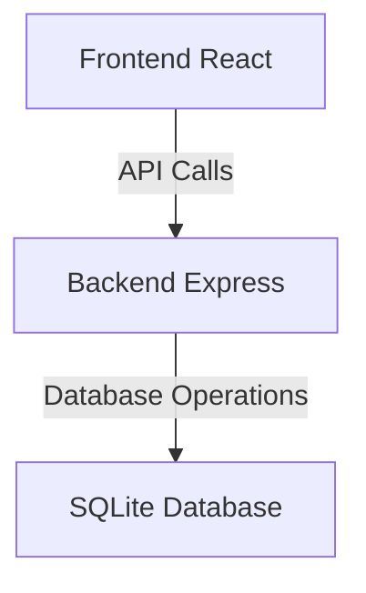
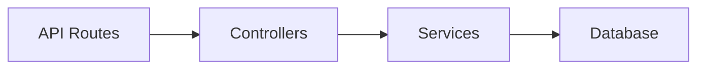
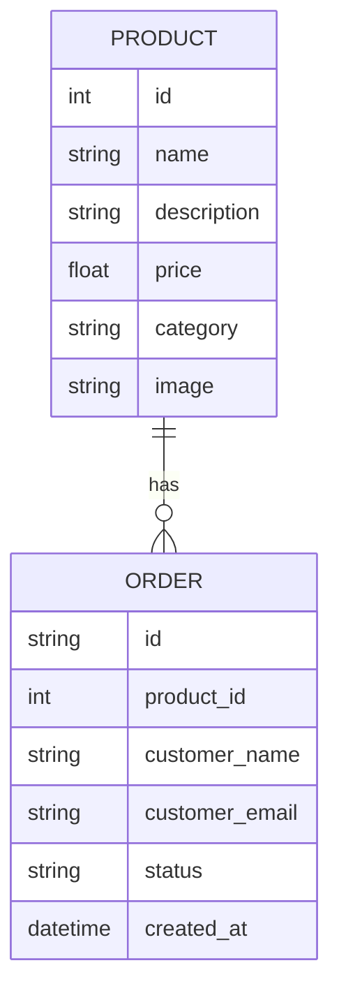

## 1. Architecture Design


## 2. Technology Description
- Frontend: React@18 + TypeScript + tailwindcss@3 + vite
- Initialization Tool: vite-init
- Backend: Express@4
- Database: SQLite

## 3. Route Definitions
| Route | Purpose |
|-------|---------|
| / | 首页 - 产品列表 |
| /product/:id | 产品详情页 |
| /order | 订单查询页 |
| /support | 支持页 |

## 4. API Definitions
```typescript
// 产品接口
interface Product {
  id: number;
  name: string;
  description: string;
  price: number;
  category: string;
  image: string;
}

// 订单接口
interface Order {
  id: string;
  productId: number;
  customerName: string;
  customerEmail: string;
  status: string;
  createdAt: string;
}
```

## 5. Server Architecture Diagram


## 6. Data Model
### 6.1 Data Model Definition


### 6.2 Data Definition Language
```sql
CREATE TABLE products (
  id INTEGER PRIMARY KEY AUTOINCREMENT,
  name TEXT NOT NULL,
  description TEXT,
  price REAL NOT NULL,
  category TEXT NOT NULL,
  image TEXT
);

CREATE TABLE orders (
  id TEXT PRIMARY KEY,
  product_id INTEGER NOT NULL,
  customer_name TEXT NOT NULL,
  customer_email TEXT NOT NULL,
  status TEXT DEFAULT 'pending',
  created_at DATETIME DEFAULT CURRENT_TIMESTAMP
);
```
