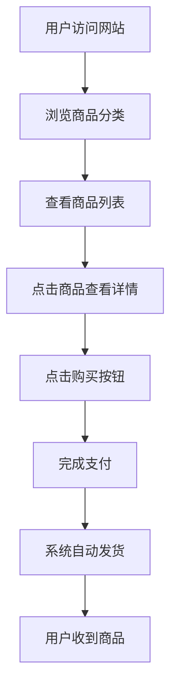

## 1. Product Overview
VIPPlus.Pro 是一个专业的数字商品平台，主要销售AI工具账号和服务。
- 提供Claude、ChatGPT、Gemini等AI工具的账号和充值服务，满足用户对AI工具的需求
- 目标用户为需要使用AI工具但不想直接付费或注册的个人用户和企业用户

## 2. Core Features

### 2.1 User Roles
| Role | Registration Method | Core Permissions |
|------|---------------------|------------------|
| Guest User | 无需注册 | 浏览商品、查看价格、购买商品 |
| Registered User | 邮箱注册 | 浏览商品、查看价格、购买商品、查看订单历史、申请售后服务 |

### 2.2 Feature Module
1. **首页**: 导航栏、商品分类、商品列表、分页控件、页脚
2. **商品详情页**: 商品信息、价格、购买按钮、商品描述
3. **订单查询页**: 订单状态查询、订单详情
4. **售后服务页**: 售后政策、提交售后申请
5. **自助充值页**: 充值流程、支付方式

### 2.3 Page Details
| Page Name | Module Name | Feature description |
|-----------|-------------|---------------------|
| 首页 | 导航栏 | 包含网站logo、首页、查询订单、售后服务、自助充值链接 |
| 首页 | 商品分类 | 提供全部、Claude、ChatGPT、Gemini、Grok、邮箱、社交等分类筛选 |
| 首页 | 商品列表 | 展示商品图片、名称、购买按钮，支持分页 |
| 首页 | 分页控件 | 显示页码、上一页/下一页按钮，支持页面切换 |
| 首页 | 页脚 | 包含条款、隐私、售后、合作等链接 |
| 商品详情页 | 商品信息 | 显示商品详细信息、价格、库存状态 |
| 商品详情页 | 购买按钮 | 点击跳转到支付页面，支持多种支付方式 |
| 订单查询页 | 订单状态查询 | 通过订单号查询订单状态和详情 |
| 售后服务页 | 售后政策 | 详细说明售后服务条款和流程 |
| 售后服务页 | 售后申请 | 提供在线提交售后申请的表单 |
| 自助充值页 | 充值流程 | 引导用户完成充值操作，支持多种充值方式 |

## 3. Core Process
用户浏览网站 → 选择商品分类 → 查看商品列表 → 点击商品查看详情 → 点击购买按钮 → 完成支付 → 系统自动发货 → 用户收到商品

## 4. User Interface Design
### 4.1 Design Style
- 主色调: 深蓝色和白色，体现专业和科技感
- 按钮风格: 圆角矩形，悬停效果明显
- 字体: 无衬线字体，清晰易读
- 布局风格: 卡片式布局，商品信息清晰展示
- 图标风格: 简约现代，与整体设计风格一致

### 4.2 Page Design Overview
| Page Name | Module Name | UI Elements |
|-----------|-------------|-------------|
| 首页 | 导航栏 | 固定顶部，白色背景，蓝色文字，响应式设计 |
| 首页 | 商品分类 | 水平排列的分类按钮，选中状态有明显标识 |
| 首页 | 商品列表 | 网格布局，每个商品包含图片、名称和购买按钮 |
| 首页 | 分页控件 | 居中显示，包含上一页/下一页按钮和页码 |
| 首页 | 页脚 | 固定底部，包含链接和版权信息 |
| 商品详情页 | 商品信息 | 左侧图片，右侧文字信息，价格突出显示 |
| 商品详情页 | 购买按钮 | 醒目的蓝色按钮，悬停时有颜色变化 |
| 订单查询页 | 订单状态查询 | 简洁的表单，输入订单号即可查询 |
| 售后服务页 | 售后政策 | 清晰的文字说明，分点列出政策内容 |
| 自助充值页 | 充值流程 | 步骤式引导，每个步骤有明确的说明 |

### 4.3 Responsiveness
- 桌面端优先设计，同时支持平板和移动设备
- 响应式布局，在不同屏幕尺寸下自动调整
- 移动设备上优化触摸交互，确保按钮和链接易于点击

### 4.4 3D Scene Guidance
- 无3D场景需求