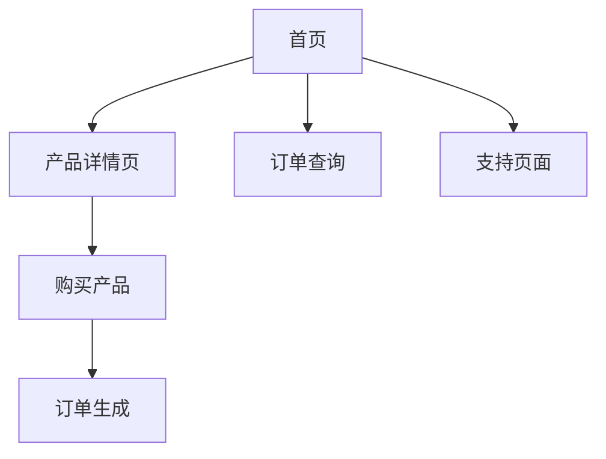

## 1. Product Overview
VIPPLUS 网站复刻项目，为用户提供数字产品购买服务，专注于虚拟商品和数字内容交易平台。

## 2. Core Features

### 2.2 Feature Module
1. **首页**：产品展示、分类导航、搜索功能
2. **产品详情页**：产品信息展示、购买功能
3. **订单查询页**：用户订单状态查询
4. **支持页**：售后政策、售后申请

### 2.3 Page Details
| Page Name | Module Name | Feature description |
|-----------|-------------|---------------------|
| 首页 | Hero 区域 | 展示平台介绍和热门产品推荐 |
| 首页 | 产品列表 | 展示所有产品，支持按分类筛选 |
| 首页 | 分类导航 | 快速跳转到不同产品分类 |
| 产品详情页 | 产品信息 | 产品图片、描述、价格展示 |
| 产品详情页 | 购买按钮 | 一键购买产品功能 |
| 订单查询页 | 订单状态 | 显示订单详细信息和状态 |
| 支持页 | 售后政策 | 详细的售后政策说明 |
| 支持页 | 售后申请 | 用户提交售后问题 |

## 3. Core Process
用户访问网站 → 浏览产品 → 选择产品 → 查看详情 → 购买产品 → 生成订单 → 完成交易

## 4. User Interface Design

### 4.1 Design Style
- 主色调：深蓝色 (#1e40af)
- 次要色：金色 (#eab308)
- 按钮风格：圆角、渐变
- 字体：使用现代字体，清晰易读
- 布局风格：卡片式布局
- 图标风格：简洁、现代化

### 4.2 Page Design Overview
| Page Name | Module Name | UI Elements |
|-----------|-------------|-------------|
| 首页 | Hero 区域 | 大标题、副标题、CTA按钮、背景渐变 |
| 首页 | 产品卡片 | 图片、标题、价格、悬停效果 |
| 首页 | 导航栏 | 固定在顶部、响应式设计 |

### 4.3 Responsiveness
- 桌面优先设计，完全响应式，适配移动端
