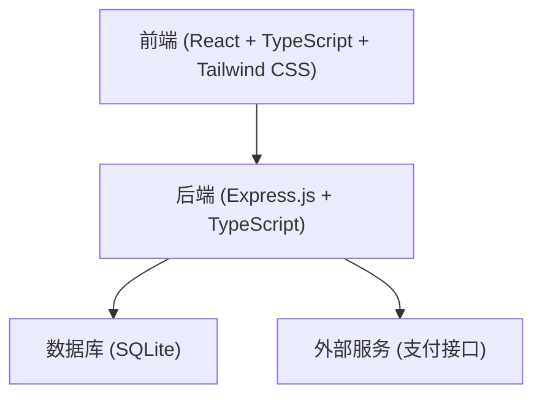
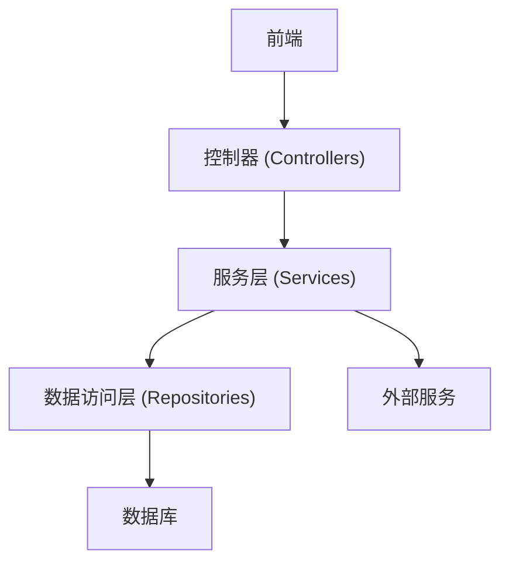
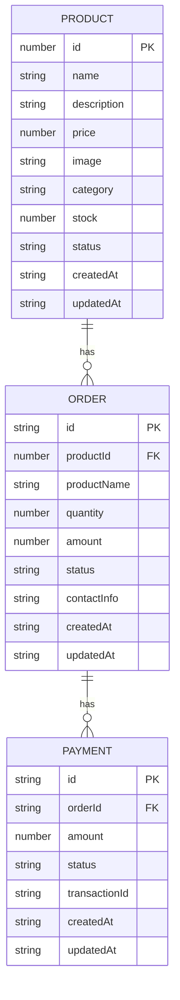

## 1. Architecture Design


## 2. Technology Description
- Frontend: React@18 + TypeScript + tailwindcss@3 + vite
- Initialization Tool: vite-init
- Backend: Express@4 + TypeScript
- Database: SQLite (轻量级，适合小型项目)
- Payment: 集成第三方支付接口

## 3. Route Definitions
| Route | Purpose |
|-------|---------|
| / | 首页，展示商品列表和分类 |
| /product/:id | 商品详情页，展示商品详细信息 |
| /order | 订单查询页，通过订单号查询订单 |
| /support | 售后服务页，包含售后政策和申请表单 |
| /recharge | 自助充值页，引导用户完成充值 |
| /api/products | 获取商品列表的API |
| /api/product/:id | 获取商品详情的API |
| /api/order | 创建订单的API |
| /api/order/:id | 查询订单详情的API |
| /api/payment/callback | 支付回调的API |

## 4. API Definitions
### 4.1 获取商品列表
- **URL**: /api/products
- **Method**: GET
- **Query Parameters**:
  - category: 商品分类（可选）
  - page: 页码（可选，默认1）
  - limit: 每页数量（可选，默认10）
- **Response**:
  ```typescript
  interface Product {
    id: number;
    name: string;
    description: string;
    price: number;
    image: string;
    category: string;
    stock: number;
    status: 'available' | 'unavailable';
  }

  interface ProductListResponse {
    products: Product[];
    total: number;
    page: number;
    limit: number;
  }
  ```

### 4.2 获取商品详情
- **URL**: /api/product/:id
- **Method**: GET
- **Response**:
  ```typescript
  interface ProductDetailResponse {
    product: Product;
  }
  ```

### 4.3 创建订单
- **URL**: /api/order
- **Method**: POST
- **Request Body**:
  ```typescript
  interface CreateOrderRequest {
    productId: number;
    quantity: number;
    contactInfo: string;
  }
  ```
- **Response**:
  ```typescript
  interface CreateOrderResponse {
    orderId: string;
    amount: number;
    paymentUrl: string;
  }
  ```

### 4.4 查询订单详情
- **URL**: /api/order/:id
- **Method**: GET
- **Response**:
  ```typescript
  interface Order {
    id: string;
    productId: number;
    productName: string;
    quantity: number;
    amount: number;
    status: 'pending' | 'paid' | 'delivered' | 'cancelled';
    contactInfo: string;
    createdAt: string;
    updatedAt: string;
  }

  interface OrderDetailResponse {
    order: Order;
  }
  ```

## 5. Server Architecture Diagram


## 6. Data Model
### 6.1 Data Model Definition


### 6.2 Data Definition Language
```sql
-- 创建产品表
CREATE TABLE IF NOT EXISTS products (
  id INTEGER PRIMARY KEY AUTOINCREMENT,
  name TEXT NOT NULL,
  description TEXT,
  price REAL NOT NULL,
  image TEXT,
  category TEXT NOT NULL,
  stock INTEGER DEFAULT 0,
  status TEXT DEFAULT 'available',
  created_at TIMESTAMP DEFAULT CURRENT_TIMESTAMP,
  updated_at TIMESTAMP DEFAULT CURRENT_TIMESTAMP
);

-- 创建订单表
CREATE TABLE IF NOT EXISTS orders (
  id TEXT PRIMARY KEY,
  product_id INTEGER,
  product_name TEXT NOT NULL,
  quantity INTEGER DEFAULT 1,
  amount REAL NOT NULL,
  status TEXT DEFAULT 'pending',
  contact_info TEXT,
  created_at TIMESTAMP DEFAULT CURRENT_TIMESTAMP,
  updated_at TIMESTAMP DEFAULT CURRENT_TIMESTAMP,
  FOREIGN KEY (product_id) REFERENCES products (id)
);

-- 创建支付表
CREATE TABLE IF NOT EXISTS payments (
  id TEXT PRIMARY KEY,
  order_id TEXT,
  amount REAL NOT NULL,
  status TEXT DEFAULT 'pending',
  transaction_id TEXT,
  created_at TIMESTAMP DEFAULT CURRENT_TIMESTAMP,
  updated_at TIMESTAMP DEFAULT CURRENT_TIMESTAMP,
  FOREIGN KEY (order_id) REFERENCES orders (id)
);

-- 初始化商品数据
INSERT INTO products (name, description, price, image, category, stock, status) VALUES
('Claude 官方礼品月卡', 'Claude 官方礼品月卡，可直接使用', 199.00, 'https://example.com/claude.jpg', 'Claude', 100, 'available'),
('Gemini Pro 年卡 自助充值', 'Gemini Pro 年卡，支持自助充值', 299.00, 'https://example.com/gemini.jpg', 'Gemini', 100, 'available'),
('GPT Plus月卡（自助充值）', 'GPT Plus月卡，支持自助充值', 299.00, 'https://example.com/gptplus.jpg', 'ChatGPT', 0, 'unavailable'),
('GPT Pro 月卡（自助充值）', 'GPT Pro 月卡，支持自助充值', 399.00, 'https://example.com/gptpro.jpg', 'ChatGPT', 100, 'available'),
('Gemini Pro 年卡成品账号（包gcp）', 'Gemini Pro 年卡成品账号，包含GCP账号', 399.00, 'https://example.com/gemini-account.jpg', 'Gemini', 100, 'available'),
('Grok Super 成品号', 'Grok Super 成品账号，可直接使用', 299.00, 'https://example.com/grok.jpg', 'Grok', 100, 'available'),
('Facebook 账号', 'Facebook 账号，已验证', 99.00, 'https://example.com/facebook.jpg', '社交', 100, 'available'),
('Threads双重验证 账户', 'Threads 双重验证账户', 149.00, 'https://example.com/threads.jpg', '社交', 100, 'available');
```